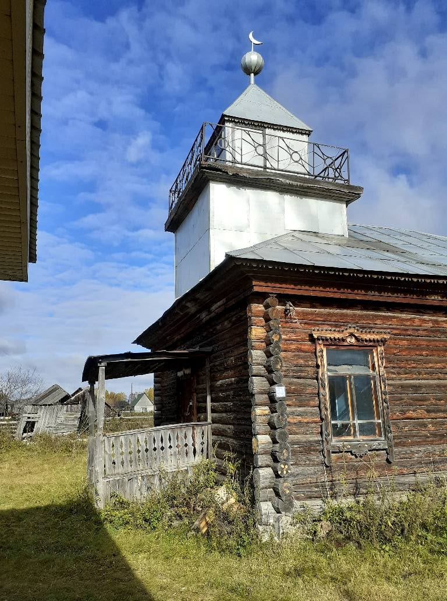
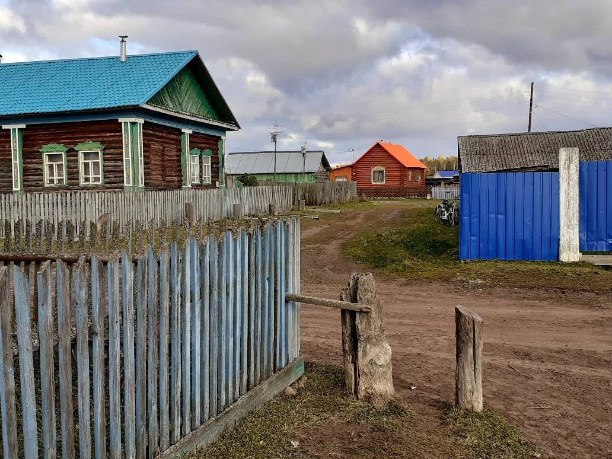
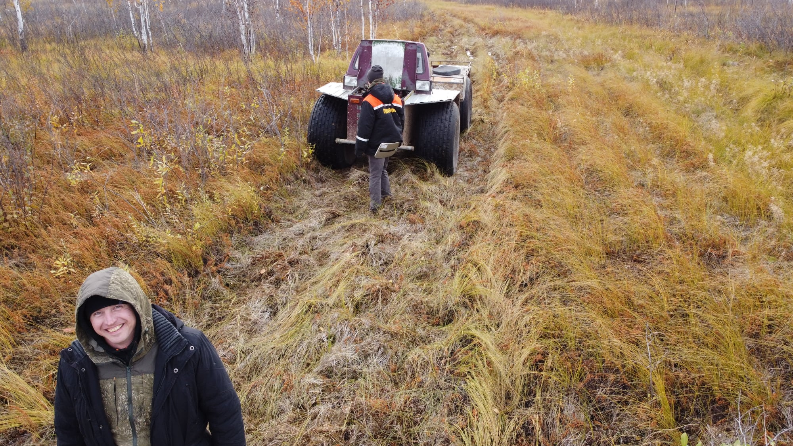
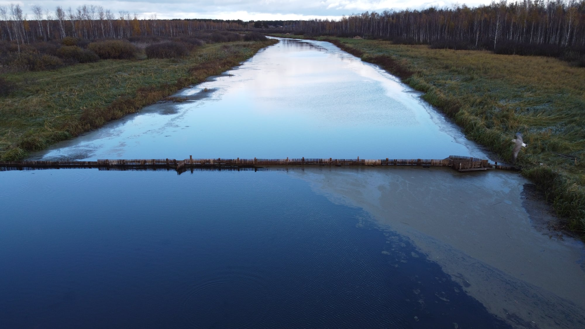
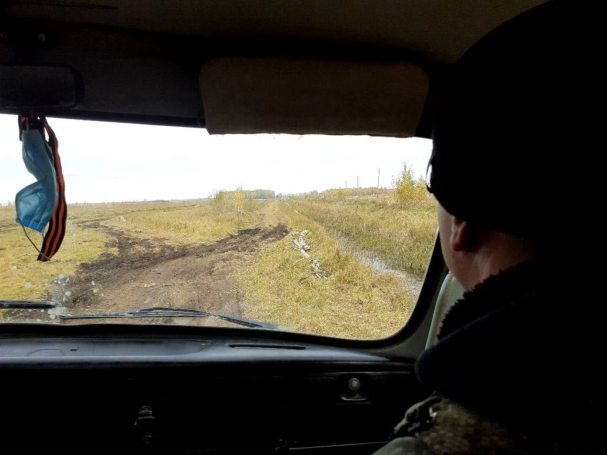
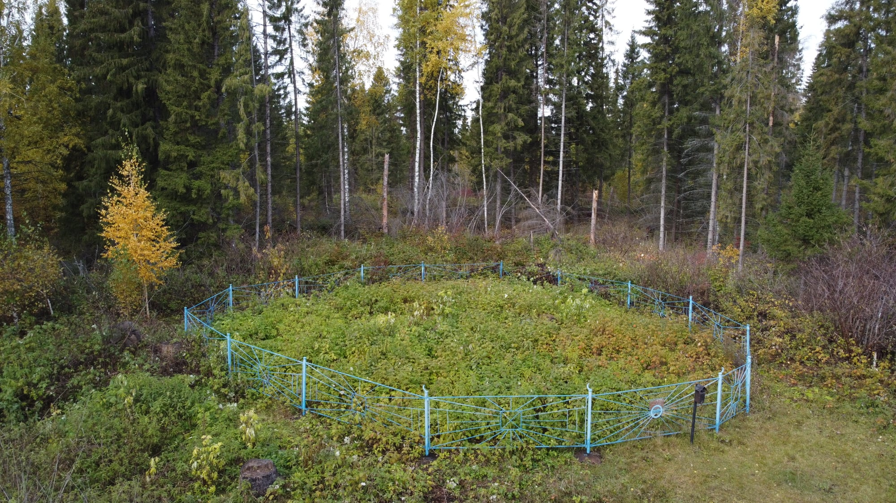

30.09.- 1.10.2021 г., прекрасный солнечный день. ТЫСЯЧА САВАБОВ КАИШКУЛЮ. Планировалось-то, что в экспедицию поедут пять человек, но двое-то не пришли, поэтому мы мчались этим утром на роскошном городском минивэне втроем. Водитель беспокоился – у него весь день был расписан, до семи часов вечера, а первый заказ оказался настолько необычным – мало того, что далеко, так надо было переезжать через Тобол на пароме, целый час ехать через подтайгу по плохому асфальту с опасностью оторвать бампер, да еще и успевать на паром обратно. Одинокие оранжевые березки трепетали в серых рассветных полях, мы же – И., М., и ваш покорный слуга, расслабились в тепле и вели ученые разговоры – про Клиффорда Гирца и его описание исламской культуры, про Анну Левенхаупт Цзин и шиитаке, про идеал брутальности в антропологии, и, разумеется, про каштидский фликинг. Всего пересказывать не буду, но вообще, будь я академическим светилом, готовым принять на себя ради всех остальных тяжелый труд Капитана Очевидность, то написал бы статью о том, что стремление современной антропологии непременно изучать границы предельного человеческого опыта, часто образующее и мейнстрим дисциплины, и ее идеал, с одной стороны, является наследием колониальной этнографии, с другой – критикой существующей академической структуры, с ее гендерными, географическими и классовыми неравенствами. Ведь повседневность куда интереснее, говорил я, она загадочна, на нее все смотрят, никто не видит. В тот момент мне казалось, что уж Каишкуль-то, куда можно доехать на машине за два часа, никакой не экстрим, как раз повседневность. Я немного ошибался, конечно, такой энергичностью, с какой мы прожили следующие пару дней, моя повседневность не отличается.

Едва мы выгрузились из минивэна на остановке автобуса в Новокаишкуле, и добрели под серым небом осени до мечети, где нас должны были встретить, как начался двухдневный марафон гостеприимства. Первым разговором, который М. завел с встретившей нас Y., был разговор про саваб и баракят – исламские термины, которыми описывается награда, которая может быть дарована мусульманину Всевышним. Вкратце, и упрощая, саваб – это то, что ты можешь заслужить сам конкретными действиями, баракят – это Божья милость, которая от тебя не зависит, или, вернее, зависит не напрямую, дается тебе по совокупности всей жизни, добродетельной или не очень. Гостеприимство в татарских деревнях часто описывается именно как саваб, причем понять, где человек все делает из искреннего к тебе интереса и расположения, как делают люди светские в обычном мире, а где именно как правоверный мусульманин, ведущий особую духовную бухгалтерию савабов – невозможно. Иногда за этой риторикой чувствуется ирония – мол, я и так рад вас видеть, но еще ведь и саваб будет, ггг. Гостеприимство началось с огромных тарелок бараньего супа. «Это все предначертано», сказал N., наш проводник в последующие два дня, «этот баран должен был быть съеден вами». Нам доставалось еще и за то, что мы путники и люди ученые – как оказалось, это очень ценится, за это много савабов. Сразу скажу, что самым тяжелым в этом путешествии было сочетание гастрономического гостеприимства с гостеприимством транспортным, приходилось много есть и быстро передвигаться на разного рода бултыхающейся и переваливающейся технике. В некоторых местах, чтобы показать, что ты наелся, надо класть кружечку набок, но этому умению учишься не сразу.

Езда из Новокаишкуля в Старый Каишкуль на бешено мчащемся уазике – вот какая была в этот раз первая «прогулка с местными». Всюду были следы тревожного лета 2021 года – ужасные шрамовидные борозды, опахивающие деревенскую околицу, закопченные верховыми пожарами березовые стволы, всюду дикий горельник, сгоревшие бревна. Проживший в этих местах всю жизнь N. рассказывал по пути очень много, но записать это мешал ревущий двигатель, да и какой смысл записывать? По-хорошему, надо бы пожить в Каишкуле с полгода, да проехать по этой дороге с десятком старожилов, а потом сравнить нарративы, но дизайн нашего исследования этого не позволяет. Здесь было поле, а здесь мы косили, а сюда я пешком ходил, но все заросло, заросло, говорил N., перекрикивая мотор. О эта деревенская ностальгия, в деревне ведь все уходит, все меняется, а людей здесь мало, все наперечет, и мест тоже – потеря каждого из них является необратимой утратой, после них действительно остаются пустоты, не замещающиеся мгновенно другими полноценностями, как в городе. Безобразный вторичный лес, затягивающий былые покосы, былые пашни – для деревенского старожила это элегические знаки старости, знаки увядания, сколько я всего здесь знал, сколько всего видел. В татарских деревнях с их сильной семейственностью, социальная структура имеет, конечно, меньше таких разрывов – даже уехав в город, человек постоянно возвращается в деревню, к своей сети родственников. «У русских, у чувашей по два-три ребенка в семье», сказала Y., когда на следующий день мы ехали в Юрмы, «все уехали в город, и все, никого не осталось. У нас, татар, не так – девять детей в семье, кто-нибудь да останется, деревня живет». Потом, правда, выяснилось, что у современного поколения все не так радужно, те же два-три ребенка, иногда пять, но такой стереотип многодетности все равно помогает надеяться. Сельские русские, на это часто натыкаешься, всегда завидуют в этом смысле татарам, мол, мы не такие дружные, но и сами вовлечены в подобные родственные сети, это я помню из детства, всегда знаешь, где живут еще Ивановы, еще Сидоровы. «А вот сосны», сказал N., показывая на конец перспективы, «значит дом, Каишкуль, мы в детстве, как идем из интерната (в Новокаишкуле – И.И.П.), всегда их видели, ускоряли шаг. Домой из интерната идешь полтора часа, туда, в интернат – три-четыре. Не хотели идти. Не обижали нас там, все было хорошо, но дома-то лучше». Столб какой-то, врытый когда-то какими-то геологами, в сгоревшем ряме вблизи Старого Каишкуля, где N. не бывал сорок лет, он так его вспоминал, так хотел найти! такое понятное чувство.

Вообще, в этой экспедиции мы искали места, где заканчивается заболотская империя резок. Судя по спутниковым снимкам, каишкульцы тоже делали между своими озерами особые каналы, так что нам предстояло выяснить, как давно это делается, и, главное, зачем. Первый коп, резки здесь называют копами (от слова «копать», разумеется), ждал нас перед Старым Каишкулем, и оказался, если приглядеться, обычной дренажной канавой, выкопанной, к тому же, всего лет пять назад при помощи экскаватора. Дренажная-то дренажная, но вообще, воду с окрестного луга она эффективно уводит только в такие сухие годы, как нынешний, а обычно, когда с затоплением луга она справиться не может, каишкульцы оставляют машины на поляне перед ней (это называется «наша стоянка») и едут по ней два километра на узких лодках-долбленках вполне лайтамакского типа, таким образом, попадая в деревню, не замочив ног. Как говорил Шерлок Холмс, какая-то странная дренажная канава, мало того, что ничего не осушает, так еще и слишком полифункциональная, где еще в мире по дренажным канавам ездят на лодках! Набор аффордансов здесь тот же, что в Заболотье – почва, которую легко копать, много воды и озер, таежное природопользование, есть только одно исключение – существуют дороги, постоянно соединяющие деревни с большим миром, и к ним, как бы плохи они ни были, приспособиться проще, чем поддерживать в состоянии, пригодном для переездов, рукотворные каналы (см. монолог X. в горельнике на барсучьем городке). В Старом Каишкуле мы поболтали с тремя крестьянами, солившими сено (тут все быстро плесневеет, сырые места, поэтому сено солят). Они рассказали нам, что мы вообще-то не по адресу, надо ехать на Чебургу, на Тахтагул, это уже Тобольский район, вот там они ездят по резкам, а здесь у нас нет такого, когда-то копали, но давно уже никто их не поддерживает. Во время войны, было дело, был колхоз «Красный Рыболов», вот тогда там прокопали с Иткуля резку, чтобы привозить на Каишкуль рыбу, варить карася, вычерпывать рыбий жир. (Тут есть свой Иткуль, другой Иткуль находится под Полевским, и я о нем тоже уже слышал). Но теперь уже ничего такого нет, копы никто не поддерживает, ничего не найдете. Вот дядя Р. да, два года назад, пришел с Чебурги на Каишкуль по рекам и озерам, но он ОЧЕНЬ устал, и никто так никогда больше не делал, да и вообще он краснобай, зачешет вам такого. Мы договорились, что поговорим вечером с дядей Р.

N., несмотря на пожилой возраст и почтенный вид, оказался тот еще джигит – со своим уазиком он обращался как с верным конем, и тот его слушался беспрекословно на всех кочках, гатях и мостиках Ярковского и Вагайского районов. На второй день И., единственный из нас автолюбитель, наконец, догадался, что уазик N. не имеет тормозов. Произошло это в тот момент, когда мы разворачивались в лесу, притормаживая об деревья. Другой бы в этой ситуации, но N. справился с честью, ни одной вмятины на сером железе. Вписавшись в дом, полный этнического коврового уюта, мы погрузились на болотоход Х., чтобы совершить поездку на север от Старого Каишкуля, целью которой, как впоследствии оказалось, была сама поездка.

И вот, еще не переварив толком взболтанный ездой на уазике съеденный на завтрак бараний суп, но уже пообедав карасями по-заболотски, ты взбираешься на болотоход, который создан людьми, для которых рессоры, комфорт и безопасность – не основной приоритет, главное – доехать. Мы расселись по бортам миниатюрного кузова. N. сначала занял почетное место в середине, единственное, где можно было сесть нормально, но потом не удержался, и забрался к нам. Оттуда ничего не видно, сказал он. Все это напоминало поездку по резке в Заболотье, но только сухопутную – болтает, качает, ветки летят в лицо, норовя вышибить глазик, и лучше бы потеплее одеться. Тут пригодилась и дорогущая плащ-палатка, купленная в прошлом году, и рыбацкие сапоги, покупка которых мне тоже далась нелегко – оказывается, резиновые сапоги – тот еще нишевый товар. Поэтому на фото с коптера я выгляжу как ненецкий мальчик, все остальные одеты куда как более штатски. Мы ехали через татарский сас (болото). N. и Х. называли проползающую мимо местность «голодные болотА», потому что тут не растет ничего вкусного, ни клюквы, ни брусники. Географы- ландшафтоведы и заболотские татары назвали бы эту местность рямом, но тут, как оказалось, рямом называют другое – лес, растущий там, где рям заканчивается. Заболотских минеральных холмов не было, и угнетенной сосны – тоже, болото, мелкие березки, камыш летит в лицо из-под колес болотохода, качаешься, как на верблюде. «Мой папа в детстве собрал коллекцию спичечных этикеток, и она каким-то образом дожила до моего детства», рассказывал я спутникам, - «В конце пятидесятых - начале шестидесятых спичечные этикетки были этакими миниплакатами, я помню один – мужик падает, не удержавшись, с борта несущейся бортовой машины, спиной назад. И мораль – ДЕРЖИСЬ КРЕПЧЕ».

В конце пути оказался горельник, лес, изрядно потрепанный летом 2021 года. Лежки лосей, следы. Медведей здесь нет, кстати. Копов мы никаких не нашли, зато поговорили на традиционные лесные темы – о злых собственниках лесных угодий, которые поделили между собой все, чем раньше пользовались селяне, и обложили последних юридически, так что и не поохотишься. <…> Кто бы сейчас ни владел этим островом леса – впечатление он оставляет суровое, никакими лесниками и не пахнет. Над головой висят полусгоревшие стволы, угли, копоть, вывороченные корни, бурелом страшный, то и дело приходится перелезать через упавшие деревья, угрюмый лес, сплошное топливо для следующего подобного года. Еще один вид подпрыгивающей мобильности – даром, что сейчас нет комаров, клещей, не жарко, гуляй не хочу. Но по такому лесу это непросто, особенно с тремя быстроногими лесовиками, норовящими уйти вперед. Легонькие сапоги через какое-то время стали тяжелы, плащ-палатку пришлось снять, в общем, отлично.

Вечером за чаем (тут часто говорят «цяй») окончательно выяснилось, что резки в этих местах делают не для езды. Копы здесь – элемент запорного рыболовства, изучением которого занимается И. Канальчики прорывали здесь, чтобы пустить рыбу в изолированное озеро, или, наоборот, дать ей возможность из него уйти, когда озеро зимой «загорится» подо льдом, выработает запас кислорода. Тогда рыба пойдет по каналу искать благоприятных условий, а канал легко перегородить, устроить запор (исэ), выловить рыбку и посадить ее в садок. Несколько таких запоров мы видели потом в путешествии. Широкие каналы для этого не нужны. Карасей здесь готовят также, как в Заболотье. <…> Вообще же в реках наших мест – экспансия ротана, это новый инвазивный вид с Дальнего Востока, который уже достиг Старого Каишкуля, но еще неизвестен в Юрме и Лаймах. Едят их не все, хоть, говорят, они вкусные. Днем я видел, как хозяйка варила полный чан этих большеротых тварей, чтобы кормить животных. Буль-буль-буль, говорили варящиеся ротаны, тяжело разевая рты.

Вечером первого дня в дом собрались рыбаки. Говорить было уже тяжело, как тем ротанам, но саваб, и нам, и им. В этой атмосфере хорошо зашли охотничьи рассказы о джиннах. Дядя Р. – огромный охотник в наколках и старомодных очках с толстыми линзами, рассказал нам две истории – про то, как джинны украли у него жареного карася, и про гигантскую норку без хвоста, которую он прогнал, вовремя вспомнив молитву. Дядя Р. имеет в местных кругах репутацию краснобая, но с нами он был сначала неразговорчив – о знаменитом путешествии из Чебурги мы узнали не очень много. А вот тема избушек его разговорила. Поговорили о перевале Дятлова, о том, что И. впервые столкнулся с хозяином не в мансийской тайге, а на съемной квартире во время путешествия в Корякию, Эдик сказал, что в духов не верит, все это самовнушение, а N. с братом рассказали о встречах с огненным змеем. N. сначала не хотел говорить о джиннах, но, вернувшись в комнату, и обнаружив, что все мужики беседуют о лесных избушках, он резко переключился в режим охотника, и включился в разговор на своих обычных лидерских основаниях. Звезды над Cтарым Каишкулем.

На следующий день поехали через Новокаишкуль и Шестовое в Юрмы. Мы должны были забрать в Новокаишкуле Y., и отвезти ее к родственникам. <…> Снова началась «поездка с местными». Путь на Юрмы – родную татарскую деревню, оказался не менее насыщенным, мы постоянно узнавали о разных подробностях местной географии. В этот день N. постоянно показывал нам направление водостока в тех или иных местах, поэтому иногда казалось, что мы плывем по морю. Проехали Средний Каишкуль, давно исчезнувшую деревню, теперь обозначенную только табличкой. В районе границы Вагайского района началась традиционная для межрайонов плохая дорога – единственное место за всю нашу экспедицию, где можно было серьезно увязнуть. Сухой двадцать первый год сделал эти места намного проходимей, чем обычно. Постороннему, как мы, человеку, понять это было трудно, но местные и М., у которого уже был опыт путешествия по этим местам, постоянно удивлялись, мол, в 2019 г. я тут пешком только мог пройти, а сегодня, везет нам, ездим на машине. По мере продвижения вглубь Вагайского района дороги становились лучше, но все равно единственное асфальтированное место в этих местах специально отмечено в вернакулярной географии. Говорят, какой-то местный дозвонился на прямую линию, и попросил высокое начальство построить мостик в том месте, где постоянно происходили аварии. Так в этих местах появился мост, который теперь все называют Юрминский Асфальт. 

<…>

В конце этого дня я вволю полетал на коптере – в основном, снимал запоры, которые во множестве обнаружил на одной реке И. Погода быстро менялась – было то ясно, то дождило. Здесь, впервые за все время своей службы «Аштага» попал под шквальный ливень, пришлось спешно садиться и вытирать его туалетной бумагой. По словам местного охотника, которого N. привел нам в помощь, вокруг местного озерца должно было быть несколько копов. Эту гидрографию еще стоит изучить, во всяком случае, ничего из того, что я наснимал, не напоминает резок Заболотья, в лучшем случае, там можно увидеть какие-то узкие переешечки, соединяющие естественные потоки.

**Оригинальный текст**:  
<https://www.facebook.com/noctu.vigilus/posts/3901306750094610>{target="_blank"} 

